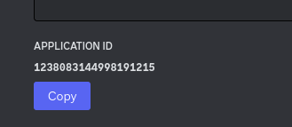
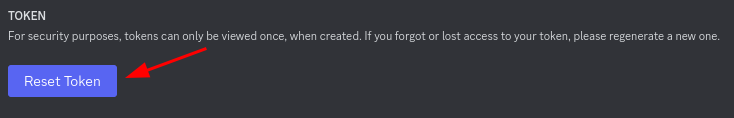
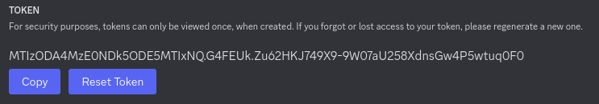
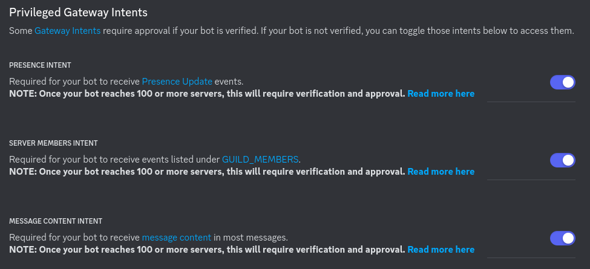

# Unipando Bot

[](https://github.com/henriquesebastiao/unipando/actions/workflows/ci.yml)

Unipando é um bot para o Discord para auxiliar estudantes do curso de Ciência da Computação da UNIP.

## Como Usar

Para adicionar o Unipando ao seu servidor no Discord, siga estas etapas:

1. Acesse o [link de convite](https://discord.com/oauth2/authorize?client_id=1237488134044913827&scope=bot&permissions=621217630912065).
2. Autorize o bot a interagir com seu servidor.

## Comandos

- `?hello` - Hello World!
- `?moeda` - Joga uma moeda para cima.
- `?md <nota-prova> <nota-ava>` - Calcula a média da disciplina `((9 * prova) * ava) / 10`.
- `?mf <nota-md> <nota-exame>` - Calcula a média final da disciplina `(md + exame) / 2`.

## Contribuindo

Unipando é desenvolvido em Python e usa a biblioteca [discord.py](https://discordpy.readthedocs.io/en/stable/).

Utilizamos as seguintes ferramentas para desenvolvimento:

- [Poetry](https://python-poetry.org/) para gerenciamento de dependências.
- Ruff, Blue e Isort para formatação de código.
- [Radon](https://radon.readthedocs.io/en/latest/) para verificar se o código não está muito esquisito 😅.
- [Bandit](https://bandit.readthedocs.io/en/latest/) para verificar se o código não tem vulnerabilidades.
- [Taskipy](https://github.com/taskipy/taskipy) para automatizar tarefas.

### Configuração do Ambiente

Crie um fork do projeto, clone o fork para o seu computador e instale as dependências:

```bash
git clone https://github.com/henriquesebastiao/unipando.git
cd unipando
poetry install
```

- Copie o arquivo `.env.example` para `.env` e adicione as variáveis de ambiente necessárias a seguir.

Agora você irá precisar criar um bot para testes durante o desenvolvimento. Acesse o [Discord Developer Portal](https://discord.com/developers/applications) e crie um novo aplicativo, atentando-se para os seguintes passos necessários:

- Na aba `General Information` copie o ID do bot e adicione ao arquivo `.env` como `BOT_ID_DEV`.

[](https://discord.com/developers/applications)

- Na aba `Bot` crie um novo token e adicione ao arquivo `.env` como `TOKEN_DEV`.

[](https://discord.com/developers/applications)
[](https://discord.com/developers/applications)

> **Atenção**: Não compartilhe o token do seu bot com ninguém. Ele é a chave de acesso a ele. Isto é feito aqui, mas já me livrei disso 🔥.

- Habilite as opções de `Privileged Gateway Intents`.

[](https://discord.com/developers/applications)

- Crie um servidor de testes e adicione o bot a ele acessando a seguinte URL:

`https://discord.com/oauth2/authorize?client_id=ID_DO_SEU_BOT&permissions=8&scope=bot+applications.commands`

Substitua `ID_DO_SEU_BOT` pelo ID do seu bot.

Este link irá adicionar o bot ao servidor com permissões de administrador.

### Executando o Bot

```bash
task run
```

### Antes de realizar um commit

Antes de realizar um commit, execute o comando `task ready` para verificar se o código está formatado corretamente e se não há nenhum problema.

Este comando executa os linters e as ferramentas de qualidade de código.